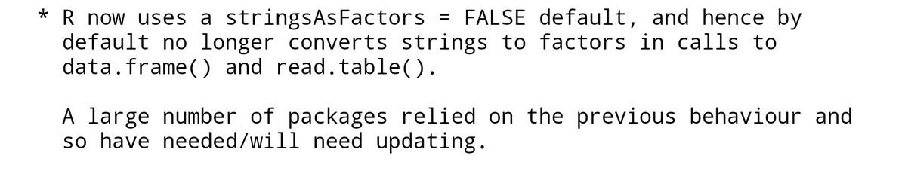

```{r, echo=FALSE}
# devtools::install_github("hadley/emo")
library(emo)
library(blogdown)
```

---
class: inverse, center, middle

#Welcome/Intro/Overview/Background

---

---
class: inverse, center, middle

# Upgrading R in the time of coronavirus

```{r, echo = FALSE, out.height = 500, fig.align='center'}
knitr::include_graphics('https://media1.tenor.com/images/4abc0a93a957de4c1db543ec3f4834a7/tenor.gif?itemid=13633421')
```

---
# R version 4.0.0 is out! `r emo::ji("evergreen_tree")`

## What’s new?

* `list2DF`
* `sort.list` for non-atomic objects
* New color palettes
* And a lot of other stuff!
--
...
--
and, `stringsAsFactors = FALSE`
---

# How do you feel about upgrading R?

Self-identify and share something you may be worried about in the chat:

* `r emo::ji("sunglasses")` Not worried 
* `r emo::ji("slightly_smiling_face")` Not too worried 
* `r emo::ji("confused")` A little worried
* `r emo::ji("fearful")` Very worried
* `r emo::ji("dizzy_face")` Confused about why there'd be worry

---
# What does it mean to upgrade a major version of R?

```{r, echo = FALSE, out.height = 250, fig.align='center'}
knitr::include_graphics('https://giffiles.alphacoders.com/168/168275.gif')
```
--

* For some - apprehension!
* For others - opportunity!

---

# Upgrade R // Install As You Go

You can "start fresh" with no packages installed when you upgrade R.

* As you write scripts that need packages, then you can install them as you go.
* Another option is to use {pacman}, that installs packages that are not already installed but mentioned in code.
* For previously written scripts, RStudio provides a helpful message if it detects a package that is not installed.

```{r, echo=FALSE}

```
---
# Upgrade R // Reinstall All Packages

You may want to be able to start working with R as soon as you update. If you are not worried about your package versions/want the newest versions of your packages...

## Reinstall After Updating

<blockquote class="twitter-tweet"><p lang="en" dir="ltr">Dread of reinstalling all your <a href="https://twitter.com/hashtag/rstats?src=hash&amp;ref_src=twsrc%5Etfw">#rstats</a> packages keeping you from updating to R 4.0.0?💀Don&#39;t despair! This script will reinstall them after you update! Code here: <a href="https://t.co/5YnqmgqyUG">https://t.co/5YnqmgqyUG</a> <a href="https://t.co/VSivonPyWJ">pic.twitter.com/VSivonPyWJ</a></p>&mdash; Isabella Velásquez (@ivelasq3) <a href="https://twitter.com/ivelasq3/status/1253766376331902979?ref_src=twsrc%5Etfw">April 24, 2020</a></blockquote> <script async src="https://platform.twitter.com/widgets.js" charset="utf-8"></script>

---
# Upgrade R // Reinstall All Packages

## Get a list of all your packages and then reinstall after updating

<blockquote class="twitter-tweet"><p lang="en" dir="ltr">You&#39;re inevitably going to have to update to R 4.0.0 soon and as a result, you&#39;ll lose most of your packages and have to reinstall them. Here&#39;s a short script to keep a list of your current R packages and how to reinstall them after updating <a href="https://twitter.com/hashtag/rstats?src=hash&amp;ref_src=twsrc%5Etfw">#rstats</a> <a href="https://twitter.com/hashtag/statstwitter?src=hash&amp;ref_src=twsrc%5Etfw">#statstwitter</a> <a href="https://t.co/NI0ZeHze2C">pic.twitter.com/NI0ZeHze2C</a></p>&mdash; Sir Panda (@dailyzad) <a href="https://twitter.com/dailyzad/status/1253506170372980737?ref_src=twsrc%5Etfw">April 24, 2020</a></blockquote> <script async src="https://platform.twitter.com/widgets.js" charset="utf-8"></script>

---

# Upgrade R // Reinstall All Packages

## Formal Packages

There are also formal packages to deal with reinstalling packages after a major R update: {installr}, {yamlpack}...

## Things to Note

* Make sure that the scripts work according to your process (for example, script 1 only works if you are downloading the binary 4.0.0)
* Take note of your Bioconductor/Github dev packages

---
# Upgrade R // Keep Old Packages

If you want to keep the previous versions of your package but upgrade R, you can bring over the old versions.

* Per ["What They Forgot To Teach You About R"](https://rstats.wtf/maintaining-r.html#how-to-transfer-your-library-when-updating-r), it is not advised to do this manually.
* Additionally, if the packages were built on 3.x, then there’s no guarantee they’d work in 4.x.
* R and packages can have system dependencies. Some of the packages may break if installed on R 4.0.0 and their  maintainers haven't upgraded their code yet.

---
# Do Not Upgrade R

<blockquote class="twitter-tweet"><p lang="en" dir="ltr">Yeah, I&#39;m just gonna act like <a href="https://twitter.com/hashtag/rstats?src=hash&amp;ref_src=twsrc%5Etfw">#rstats</a> 4.0 doesn&#39;t exist until I finish these papers. <br>MRAN January snapshot continues! <a href="https://t.co/RrFCR86kcV">pic.twitter.com/RrFCR86kcV</a></p>&mdash; Chase Clark (@ChasingMicrobes) <a href="https://twitter.com/ChasingMicrobes/status/1253036167941021696?ref_src=twsrc%5Etfw">April 22, 2020</a></blockquote> <script async src="https://platform.twitter.com/widgets.js" charset="utf-8"></script>

```{r, echo = FALSE, out.height = 250, fig.align='center'}
knitr::include_graphics('https://media.giphy.com/media/IdmfEtnMWPzOg/200.gif')
```

---
# Do Not Upgrade R

```{r, echo=FALSE}

```

Even if you’d rather wait for R v4.1.0, there are a few things you can do:

* Test it out before you upgrade
* Make it so you can switch between R versions: use RSwitch on macOS by @hrbrmstr

---
.pull-left[
# Pros

* "Hit the ground running"
* Refinding packages not on CRAN
* Dependencies
* Internet speed

]

.pull-right[
# Cons

* Can’t have a ‘fresh start’
* Dependencies
* Packages may not work with new version of R

]


## Considerations


* How do you code?
* How fragile in your code?
* What do your dependencies look like?
* How fast is your internet?
* How quick is your deadline?

---

# Other Options

* packrat (old RStudio package management solution)
* RStudio Package Manager
* Docker (rocker)
* Conda
* and....
--
*
 renv

---
class: inverse, center, middle

# Package management in projects

```{r, echo=FALSE, out.height=300}
knitr::include_graphics('img/renv-hex.svg')
```

---
# Mike's content


---
class: inverse, center, middle

# Conclusion/Questions?

---
# References

## What's New

* [Four New Useful Features in R 4.0.0](https://www.r-bloggers.com/4-for-4-0-0-four-useful-new-features-in-r-4-0-0/)
* [R 4.0.0 Now Available](https://www.r-bloggers.com/r-4-0-0-now-available-and-a-look-back-at-rs-history/
)
