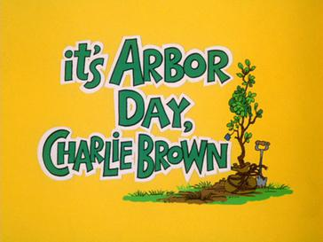
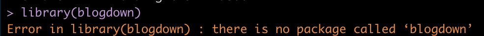
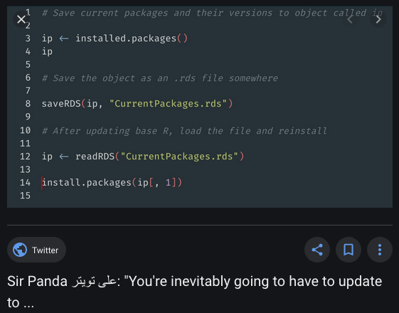
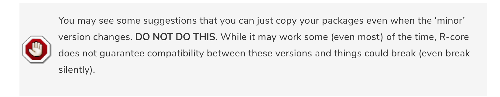
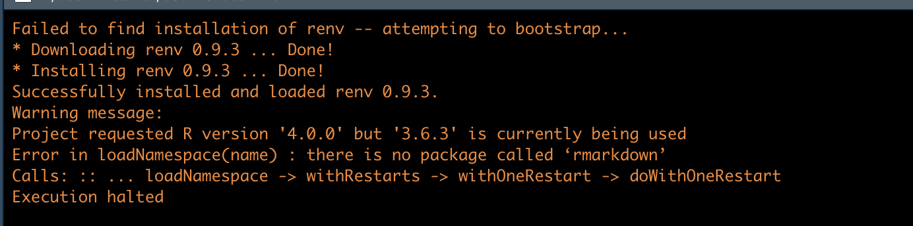
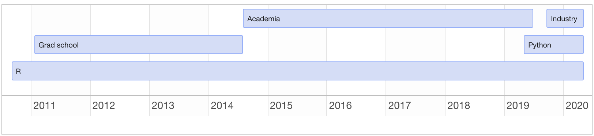
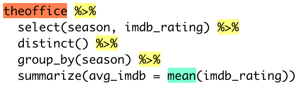
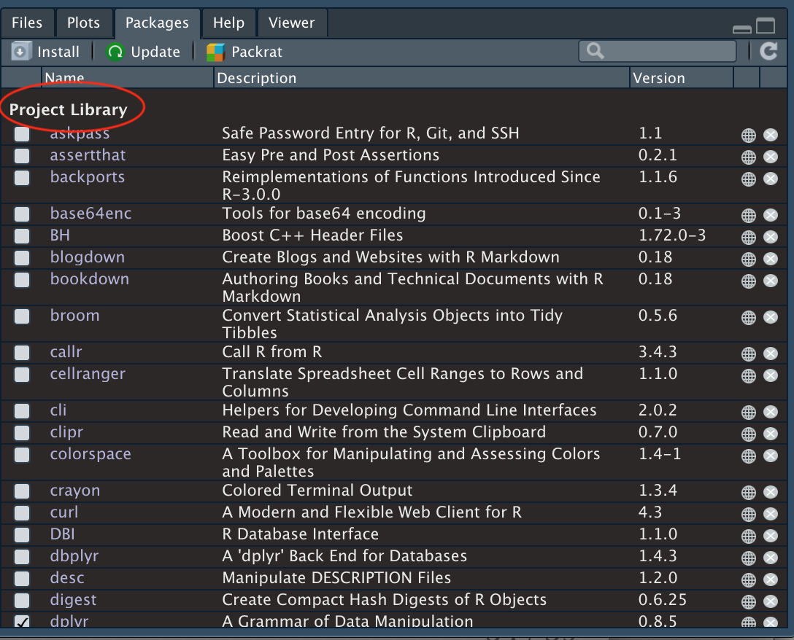

```{r, echo=FALSE, include=FALSE}
# devtools::install_github("hadley/emo")
library(emo)
library(blogdown)
library(schrute)
library(tidyverse)
library(knitr)
library(kableExtra)
library(flair)
```

---
class: inverse, center, middle

#Welcome/Intro/Overview/Background

---
class: inverse, center, middle

# Hello!


Isabella Velásquez

Twitter: @ivelasq3

Website: ivelasq.rbind.io

---
class: inverse, center, middle

# Upgrading R in the time of coronavirus

```{r, echo = FALSE, out.height = 500, fig.align='center'}
knitr::include_graphics('https://media1.tenor.com/images/4abc0a93a957de4c1db543ec3f4834a7/tenor.gif?itemid=13633421')
```

---

# R version 4.0.0 is out! `r emo::ji("evergreen_tree")`

## What’s new?

* `list2DF`
* `sort.list` for non-atomic objects
* New color palettes
* And a lot of other stuff!

```{r, echo = FALSE, out.height = 250, fig.align='center'}

```
--
...
--
and, `stringsAsFactors = FALSE`
---

# Chat

How do you feel about upgrading R?
Self-identify and share something you may be worried about in the chat:

* `r emo::ji("sunglasses")` Already upgraded
* `r emo::ji("grinning_face")` Not worried 
* `r emo::ji("slightly_smiling_face")` Not too worried 
* `r emo::ji("confused")` A little worried
* `r emo::ji("fearful")` Very worried
* `r emo::ji("dizzy_face")` Confused about why anyone is worried

---
# What does it mean to upgrade a major version of R?

```{r, echo = FALSE, out.height = 250, fig.align='center'}
knitr::include_graphics('https://giffiles.alphacoders.com/168/168275.gif')
```

* For some - apprehension!
* For others - opportunity!

---
# What's wrong with reinstalling packages?

--

`r emo::ji("fearful")` `r emo::ji("fearful")` `r emo::ji("fearful")`

```{r, echo = FALSE, out.height = 250, fig.align='center'}

```

---

# Upgrade R // Install As You Go

You can "start fresh" with no packages installed when you upgrade R. 

```{r, echo=FALSE, out.height=250, fig.align='center'}
knitr::include_graphics('https://i.kym-cdn.com/entries/icons/original/000/006/077/so_good.png')
```

* Another option is to use {pacman} that installs packages that are not already installed but mentioned in code.
* For previously written scripts, RStudio provides a helpful message if it detects a package that is not installed.

```{r, echo=FALSE}
knitr::include_graphics('img/brms.png')
```

---
# Upgrade R // Reinstall All Packages

```{r, eval = F}
# setup
if (!require(tidyverse)) install.packages("tidyverse")
if (!require(fs)) install.packages("fs")
library(tidyverse)
library(fs)
```

--

```{r, eval = F}
# get all installed R versions
if (Sys.info()[["sysname"]] == "Darwin") { 
  r_dir <- tibble::tibble(path = fs::dir_ls(fs::path_dir(fs::path_dir(fs::path_dir(.libPaths()[[1]])))))
}
if (Sys.info()[["sysname"]] %in% c("Linux", "Windows")) {
  r_dir <- tibble::tibble(path = fs::dir_ls(fs::path_dir(.libPaths()[[1]])))
}
```

---

```{r, eval = F}
# cue music
r_dir <- r_dir %>%
  # drop current R version
  dplyr::filter(!(stringr::str_detect(path, "Current"))) %>%
  # extract the current and penultimate R versions as strings
  dplyr::rowwise() %>%
  dplyr::mutate(version = as.numeric(stringr::str_extract(path, "[0-9]\\.[0-9]"))) %>%
  dplyr::ungroup() %>%
  dplyr::mutate(new_r = dplyr::nth(version, -1L), old_r = dplyr::nth(version, -2L)) %>%
  dplyr::mutate_at(vars("new_r", "old_r"), ~as.character(formatC(.x, digits = 1L, format = "f"))) %>%
  dplyr::filter(version == old_r)
```

--

```{r, eval = F}
# get new and old R library paths
new_libpath <- .libPaths()
old_libpath <- stringr::str_replace(new_libpath, r_dir$new_r, r_dir$old_r)
# get list of old installed R packages
pkg_list <- as.list(list.files(old_libpath))
```

---

```{r, eval = F}
# get new and old R library paths
new_libpath <- .libPaths()
old_libpath <- stringr::str_replace(new_libpath, r_dir$new_r, r_dir$old_r)
# get list of old installed R packages
pkg_list <- as.list(list.files(old_libpath))
```

--

```{r, eval = F}
# define install_all() function
install_all <- function(x) {
  print(x)
  install.packages(x, quiet = TRUE)
}
```

--

```{r, eval = F}
# install all R packages in pkg_list
purrr::quietly(purrr::walk(pkg_list, install_all))
```

---
# Upgrade R // Reinstall All Packages

## Other Options

```{r, echo=FALSE, out.height=250,fig.align='center'}

```

* Formal packages: {installr}, {yamlpack}...

---
# Upgrade R // Keep Old Packages

If you want to keep the previous versions of your package but upgrade R, you can bring over the old versions.

```{r, echo=FALSE}

```

```{r, echo=FALSE}
knitr::include_graphics('img/stringasfactors.jpg')
```

.footnote[
Warning image from https://rstats.wtf/maintaining-r.html
]

---
# Think of your Dependencies

<blockquote class="twitter-tweet"><p lang="und" dir="ltr"> <a href="https://t.co/xtfH4w3SiP">pic.twitter.com/xtfH4w3SiP</a></p>&mdash; Andrew Heiss (@andrewheiss) <a href="https://twitter.com/andrewheiss/status/1021944992351186944?ref_src=twsrc%5Etfw">July 25, 2018</a></blockquote> <script async src="https://platform.twitter.com/widgets.js" charset="utf-8"></script>

---
# Do Not Upgrade R

<blockquote class="twitter-tweet"><p lang="en" dir="ltr">Yeah, I&#39;m just gonna act like <a href="https://twitter.com/hashtag/rstats?src=hash&amp;ref_src=twsrc%5Etfw">#rstats</a> 4.0 doesn&#39;t exist until I finish these papers. <br>MRAN January snapshot continues! <a href="https://t.co/RrFCR86kcV">pic.twitter.com/RrFCR86kcV</a></p>&mdash; Chase Clark (@ChasingMicrobes) <a href="https://twitter.com/ChasingMicrobes/status/1253036167941021696?ref_src=twsrc%5Etfw">April 22, 2020</a></blockquote> <script async src="https://platform.twitter.com/widgets.js" charset="utf-8"></script>

---
# Do Not Upgrade R

Even if you’d rather wait for R v4.1.0, there are a few things you can do:

* Test it out before you upgrade
* Make it so you can switch between R versions: use RSwitch on macOS by @hrbrmstr

```{r, echo = FALSE, out.height = 250, fig.align='center'}
knitr::include_graphics('https://media0.giphy.com/media/xUA7aUNw61j9Vdzs0U/giphy.gif')
```

---
# Considerations

* How do you code?
* How feasily can you refind your non-CRAN packages?
* How fragile in your code?
* Do you want a 'fresh start'?
* Will your packages work with R 4.0.0?
* What do your dependencies look like?
* How fast is your internet?
* How quick is your deadline?

--

```{r, echo=FALSE, fig.align='center', out.height=200}

```

---

# Other Options

* packrat (old RStudio package management solution)
* RStudio Package Manager
* Docker (rocker)
* Conda
* and....
--

* renv

---
class: inverse, center, middle

# Package management in projects

```{r, echo=FALSE, out.height=300}
knitr::include_graphics('img/renv-hex.svg')
```

---

# Poll

What is your opinion/familiarity with Python?

* `r emo::ji("snake")` What's Python? I don't like snakes!!
* `r emo::ji("angel")` I love R and use Python sparingly if at all
* `r emo::ji("devil")` I love Python and use R sparingly if at all
* `r emo::ji("shrug")` I'm an equal opportunity programmer and will use any tool to get the job done

---
# A brief history of my programming past:

```{r, echo=FALSE, fig.align='center', out.height=200}

```

> A language that doesn't affect the way you think about programming, is not worth knowing.
> - Alan Perlis

---
# Some things I've learned from Python:

```{r echo=F, out.width=50, fig.align='left'}
  knitr::include_graphics('https://upload.wikimedia.org/wikipedia/commons/thumb/c/c3/Python-logo-notext.svg/1200px-Python-logo-notext.svg.png')
```

.pull-left[ 

Virtual environments are a big thing and use of package management tools is widespread in Python community:
    
  - `pipenv`
  - `virtualenv`
  - `venv`
  - `pyvenv`
  
  ]
.pull-right[
  This is a good thing for reproducibility!
]

---
# Reproducible data science with R 

.pull-left[

  ###  Literate programming:

  - Sweave 
  - knitr
  - Markdown
]

.pull-right[

  ### Package management:

  Less of a focus in the community until recently.
  
  - Packrat
]

---
## Introducing: `renv`

- Oct 2019: `renv 0.8.0` released on CRAN 
- Feb 2020: latest release (`renv 0.9.3`)

Goal is for `renv` to be a stable replacement to `Packrat`

### Philosophy of `renv` 

> Any of your existing workflows should just work as they did before

---
# Workflow overview:


- `renv::init()`: Initialize a new project-local environment with a private R library
- Business as usual, installing and removing new R packages as needed
- `renv::snapshot()`: Save the state of the project library to the lockfile
- More business as usual
- `renv::snapshot()`: Save project library again
- `renv::restore()`: Revert to the previous state as encoded in the lockfile if your attempts to update packages introduced some new problems.

---
# schrute package

--

The entire transcript from The Office
--
...
--
in Tidy Format!


```{r, echo=FALSE, fig.align='center', out.height=300}
knitr::include_graphics('https://media3.giphy.com/media/lMVNl6XxTvXgs/200w.webp?cid=ecf05e47ff356c33f2489eefdcfff62be8ab2bca7b24bab2&rid=200w.webp')
```

---

Available on CRAN:
```{r load-schrute, tidy=FALSE, eval=FALSE}
# install.packages("schrute")
library(schrute)

data(theoffice)
head(theoffice)
```

```{r schrute-head, tidy=FALSE, echo=FALSE, results='asis'}
data(theoffice)

theoffice %>% 
  head() %>% 
  knitr::kable() %>% 
  kableExtra::kable_styling(bootstrap_options=c('striped', 'hover', 'condensed', 'responsive'), font_size=7)
```

---

Being good package managers and reproducible data scientists, let's

1. Start an R project
2. Start a reproducible report in R Markdown <sup>1</sup>
3. Set up `renv`:

```{r tidy=FALSE, eval=FALSE}
renv::init()
```

This will initialize a `lockfile` with all packages and dependencies detected in the project. 

.footnote[
[1] For our purposes, the R Markdown part will be make-believe. I'll just show the results in the slides
]

---
Let's look at average IMDB ratings over the seasons:

```{r office_stats, tidy=FALSE}
theoffice %>% 
  select(season, imdb_rating) %>% 
  distinct() %>% 
  group_by(season) %>% 
  summarize(avg_imdb = mean(imdb_rating))

```

---
## Make a quick ggplot...

.pull-left[
```{r tidy=FALSE, echo=FALSE, results='asis'}
theoffice %>%
  select(season, imdb_rating) %>% 
  distinct() %>% 
  group_by(season) %>% 
  summarize(avg_rating = mean(imdb_rating)) %>% 
  ggplot(aes(x=season, y=avg_rating)) + 
  geom_point() + 
  geom_line()
```
]

.pull-right[
Sounds about right to Office fans:

- First few seasons were great
- Slump in middle
- Things got weird at the end
- Slight recovery with final season

]

---
# Share with the world!

- You share code on GitHub
- Eager to build on your groundbreaking results, collaborators fork your repo

---

# How about some flair?

```{r, echo=FALSE, fig.align='center', out.height=100}
knitr::include_graphics('https://i.imgflip.com/1hzigk.jpg')
```

--

After all your hard work on your report that you've now shared with the world, you find out about the brand new `flair` package <sup>1</sup>. 

This is a perfect way to highlight those tricky code bits to help your co-workers learn R.

.footnote[
[1] Just released on May 4th!
]

---

# Install from CRAN

```{r eval=FALSE}
install.packages("flair")
```

--

Now our lockfile is out of date! 


--

That's a simple fix: `renv::snapshot()` will update the lockfile. 

--

Next, revise your code with the appropriate number of flair:

```{r decorate, eval=FALSE}
decorate('theoffice %>%
  select(season, imdb_rating) %>%
  distinct() %>%
  group_by(season) %>%
  summarize(avg_imdb = mean(imdb_rating))') %>%
  flair('%>%') %>%
  flair('theoffice', background='Coral') %>%
  flair('mean', background='Aquamarine')
```
---
````{r, echo=F, out.height=300, fig.align='center'}

````

---

---

# Deeper dive

`renv::init()` creates:

- lockfile named `renv.lock`
- project-local environment with private library (`renv/library`)
  - separate from system libary
  - created by crawling for dependencies with `renv::dependencies()`
  - Packages copied from user library if already installed
    - Instead of re-installing from CRAN

````{r, echo=F, out.height=200, fig.align='center'}

````

---

# Deeper dive

- `renv::snapshot()`: saves state of project to lockfile (`renv.lock`)

--

- `renv::restore()`: reverts to previous state of lockfile if package installation attempts are unsuccessful


---

# Package sources

Compatible with 

- CRAN
- GitHub
- BioConductor
- GitLab
- Bitbucket
- Custom/local packages

The `DESCRIPTION` file of a package is used to infer the source

---
# Comparison with Packrat<sup>1</sup>:

1. `renv.lock` is a JSON file, ease of use with other tools
2. `renv` doesn't attempt to track package tarballs
3. `renv` doesn't track "stale" packages, installed but not recorded in lockfile
4. `renv` uses a global cache across all projects maintained with `renv`, reducing disk space
5. More configurable dependency discovery

.footnote[
[1] Abbreviated from `renv` documentation website
]

---

# Collaboration

As in the `schrute`/`flair` example, collaboration is easiest with a centrol version control repository (like GitHub)

-- 
Collaborators can run `renv::init()` from `renv.lock` included in repository. 

-- 

Collaborators can update lockfile with any packages they install via `renv::snapshot()` and then push updated lockfile to central repo. 


---
# Use with Python

If your project uses both R and Python ,(hen `renv` can manage both!

---

Compatible with

- `reticulate`
- Virtual environments
- Conda environments

---

# Conclusion

- Learning a new language can motivate you to improve skills in a language you already know

--

- R has an exciting new option for improving reproducibility even more

--

- `renv` has lots of options and flexibility but retains simplicity 

---
class: inverse, center, middle

# Questions?

## Isabella Velásquez, @ivelasq3

---
# References

## More on `renv`

 [renv website](rstudio.github.io.renv)

